# Mood & Productivity: The Science of a Student's Day

**Author:** Büke Karamustafa  
**Course:** DSA 210 Introduction to Data Science (Spring 2025–2026)

---

## Project Overview

This project investigates how everyday lifestyle factors — sleep, stress, outdoor time, negative events, and weather perception — influence a student's mood and productivity. By analyzing self-reported daily observations from multiple participants, this study applies Exploratory Data Analysis (EDA), statistical correlation analysis, and logistic regression to uncover the hidden patterns in human daily experience.

**Central Question:** Can we predict a person's mood and productivity from their daily habits?

---

## Repository Structure

```
DSA210-Term-Project/
│
├── data/
│   └── processed/
│       └── data.csv               # Main dataset used in the analysis
│
├── notebooks/
│   └── edafinal.ipynb             # Full EDA + ML notebook
│
├── figures/                       # All generated visualizations
├── data_synthetic.csv             # Synthetically generated data
├── requirements.txt               # Python dependencies
├── DSA210_Project_Proposal.pdf    # Original project proposal
└── README.md
```

---

## Dataset

- **Source:** Daily survey-like self-reported observations collected from multiple student participants.
- **Format:** Each row represents one participant's responses for a single day. (210 observations total)
- **Preprocessing:** Semicolon-delimited CSV; all variables standardized to consistent numeric scales prior to analysis.

### Variables

| Variable          | Type    | Description                                                  |
|-------------------|---------|--------------------------------------------------------------|
| `mood`            | Numeric | Daily mood score (self-reported)                             |
| `productivity`    | Numeric | Perceived productivity for the day                           |
| `energy`          | Numeric | Self-reported energy level                                   |
| `sleep_hours`     | Numeric | Total hours of sleep the previous night                      |
| `negative_event`  | Binary  | Whether a negative event occurred (0 = No, 1 = Yes)         |
| `stress`          | Numeric | Stress level (self-reported scale)                           |
| `outdoor_time`    | Numeric | Time spent outdoors                                          |
| `weather_feeling` | Numeric | Perceived effect of weather on overall wellbeing             |

---

## How to Run

**1. Clone the repository:**
```bash
git clone https://github.com/bukekaramustafa/DSA210-Term-Project.git
cd DSA210-Term-Project
```

**2. Install dependencies:**
```bash
pip install -r requirements.txt
```

**3. Launch the notebook:**
```bash
jupyter notebook notebooks/edafinal.ipynb
```

> All visualizations will be automatically saved to the `/figures` folder when the notebook is run.

---

## Exploratory Data Analysis (EDA)

### 1. Distributions of Key Variables

The histograms below show the spread of the core outcome variables across all participants and days.

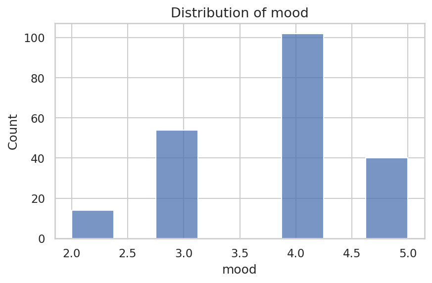
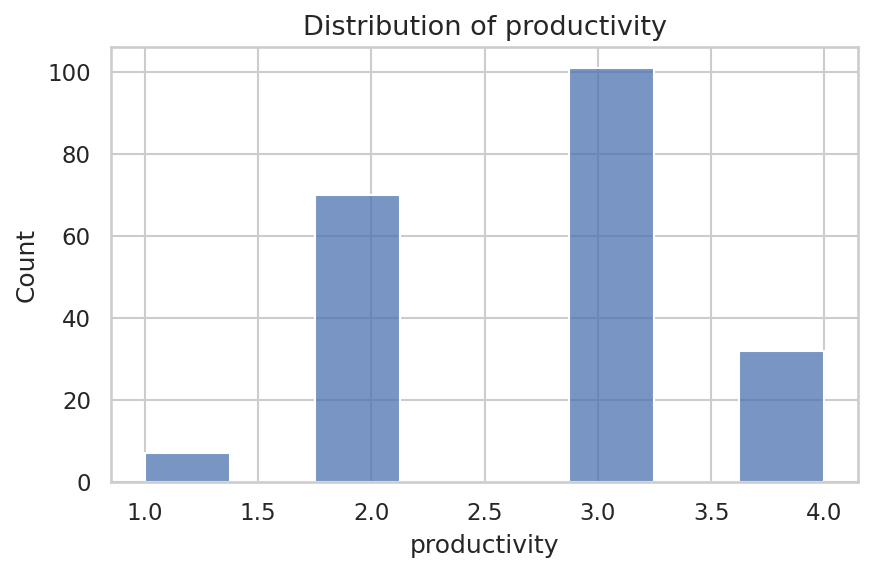
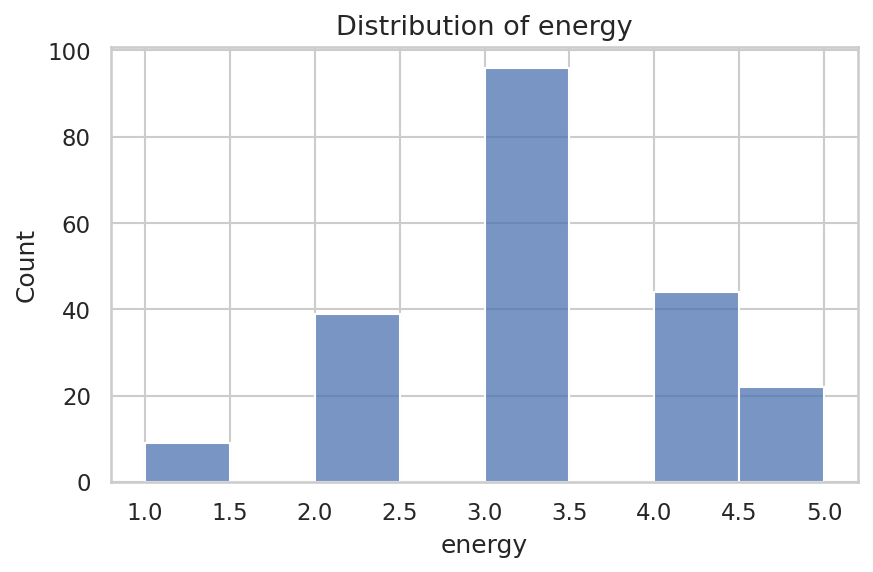
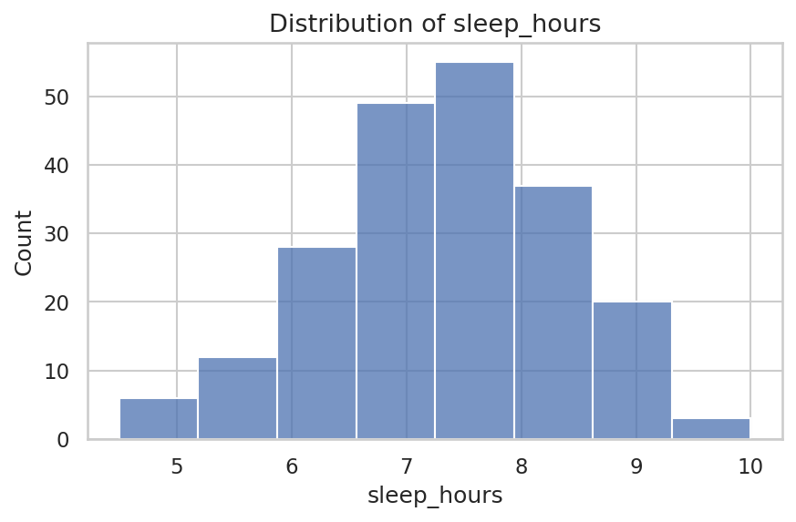
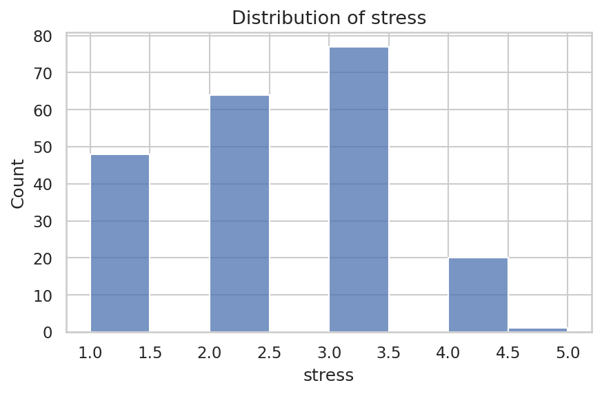

---

### 2. Negative Event vs. Mood

This boxplot compares mood scores on days with and without a negative event.

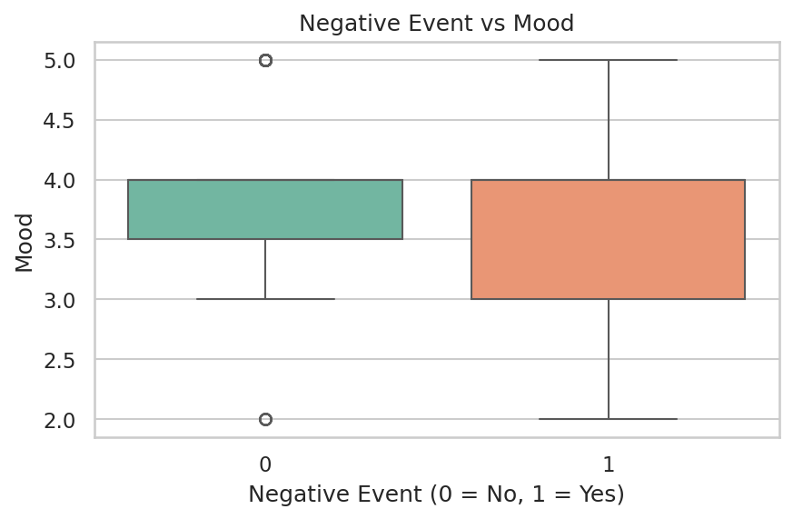

Days with a negative event (1) are consistently associated with lower mood scores, confirming that acute stressors have an immediate psychological impact.

---

### 3. Stress vs. Productivity

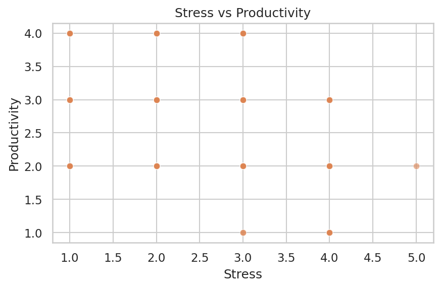

Higher stress levels tend to suppress perceived productivity. The downward trend in this scatterplot is consistent with the negative correlation observed in the full correlation matrix.

---

### 4. Sleep Hours vs. Mood

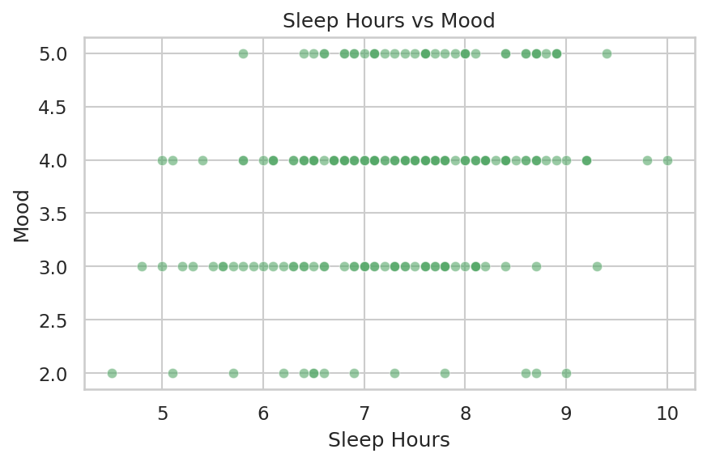

Even within the natural variation of the dataset, more sleep is associated with better mood — one of the strongest relationships observed in this study.

---

### 5. Weather Perception vs. Mood

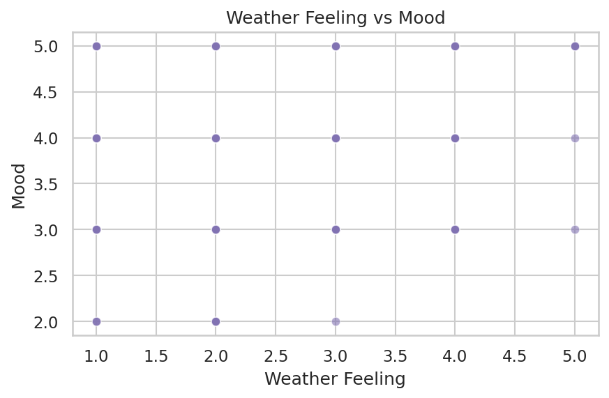

The perceived effect of weather shows a mild positive relationship with mood, suggesting that subjective weather experience — rather than objective measurements — is what matters psychologically.

---

### 6. Outdoor Time vs. Mood

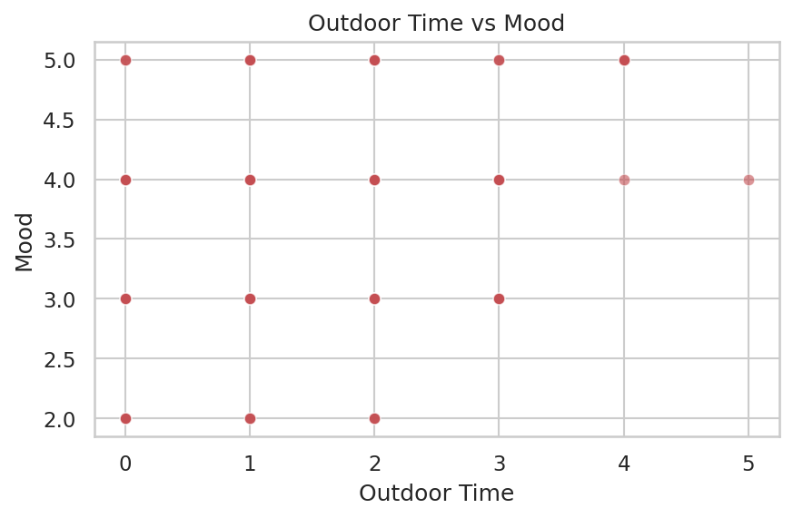

---

### 7. Correlation Matrix

The heatmap below summarizes the Pearson correlations between all numeric variables at a glance.

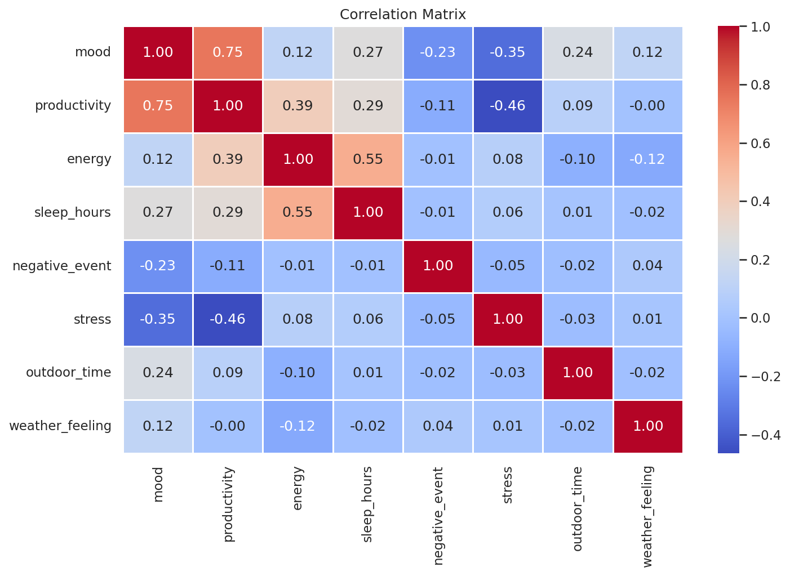

The Pearson correlation coefficient between two variables $X$ and $Y$ is computed as:

$$r_{XY} = \frac{\sum_{i=1}^{n}(X_i - \bar{X})(Y_i - \bar{Y})}{\sqrt{\sum_{i=1}^{n}(X_i - \bar{X})^2 \cdot \sum_{i=1}^{n}(Y_i - \bar{Y})^2}}$$

where $\bar{X}$ and $\bar{Y}$ are the sample means of $X$ and $Y$ respectively, and $n$ is the number of observations.

*EDA Interpretation:* Mood and productivity are strongly positively correlated. Sleep hours show a clear positive relationship with both mood and energy. Stress is negatively associated with productivity. Weather perception and outdoor time show milder but consistent effects on mood.

---

## Machine Learning: Logistic Regression Mood Classifier

To test whether mood can be predicted from daily lifestyle inputs, a **Logistic Regression** classifier was trained on the dataset.

- **Target variable:** High Mood (1) vs. Lower Mood (0), split at the median mood score
- **Features used:** `sleep_hours`, `stress`, `outdoor_time`, `weather_feeling`, `negative_event`, `energy`
- **Train/test split:** 80% / 20%
- **Preprocessing:** StandardScaler applied to all features

### Model Formula

Logistic regression estimates the probability of high mood using the sigmoid function:

$$P(\text{High Mood} = 1 \mid \mathbf{x}) = \frac{1}{1 + e^{-(\beta_0 + \beta_1 x_1 + \beta_2 x_2 + \cdots + \beta_p x_p)}}$$

where $x_1, x_2, \ldots, x_p$ are the feature values (sleep hours, stress, outdoor time, etc.) and $\beta_0, \beta_1, \ldots, \beta_p$ are the learned coefficients.

The model is trained by minimizing the **log-loss** (binary cross-entropy):

$$\mathcal{L} = -\frac{1}{n} \sum_{i=1}^{n} \left[ y_i \log(\hat{p}_i) + (1 - y_i) \log(1 - \hat{p}_i) \right]$$

### Confusion Matrix

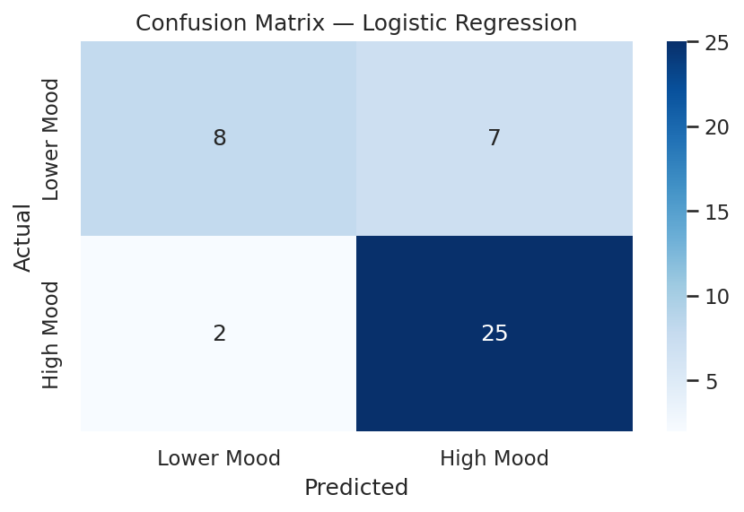

### Feature Coefficients

The bar chart below shows which daily factors most strongly push mood up or down according to the model.

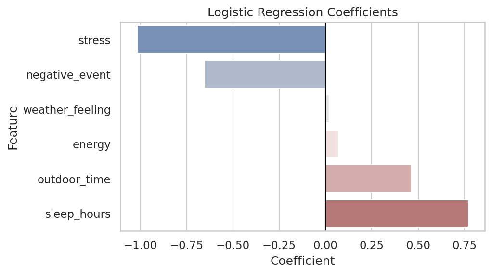

**Interpretation:** Features with positive coefficients (e.g. sleep, energy) are associated with higher mood. Features with negative coefficients (e.g. stress, negative events) are associated with lower mood — consistent with our EDA findings.

---

## Hypothesis Testing

- **H₀ (Null Hypothesis):** Daily lifestyle factors have no significant relationship with mood or productivity.
- **H₁ (Alternative Hypothesis):** At least one lifestyle factor significantly explains variance in mood or productivity scores.

The significance of each correlation is evaluated using the $t$-statistic:

$$t = r \sqrt{\frac{n - 2}{1 - r^2}}$$

which follows a $t$-distribution with $n - 2$ degrees of freedom under $H_0$. A result is considered statistically significant at $p < 0.05$.

Based on the correlation analysis and logistic regression results, the null hypothesis is **rejected** for multiple variables — particularly sleep hours, stress, and negative events, which show statistically meaningful relationships with mood.

---

## Key Findings

- **Mood ↔ Productivity:** Strong positive correlation — students who report higher mood also tend to report higher productivity.
- **Sleep ↔ Mood & Energy:** More sleep hours consistently correspond to better mood and higher energy levels.
- **Negative Events → Lower Mood:** Days with a negative event are associated with measurably lower mood scores.
- **Stress → Reduced Productivity:** Higher stress reliably suppresses perceived productivity.
- **Weather Perception → Mild Mood Effect:** Subjective weather experience has a mild but consistent positive relationship with mood.

---

## Limitations & Future Work

**Current Limitations:**
- Dataset is self-reported, introducing potential subjective bias.
- 210 observations over a limited time period may restrict generalizability.
- `weather_feeling` is perception-based, not an objective measurement.

**Future Directions:**
- Integrate real weather API data alongside perceived weather to separate objective vs. subjective effects.
- Expand participant pool and data collection period.
- Explore time-series modeling to capture carry-over effects (e.g. does poor sleep on Day 1 affect mood on Day 2?).
- Apply more advanced models such as Random Forest or Gradient Boosting for improved prediction.

---

## AI Assistance Disclosure

AI tools were used to support code organization, formatting, and editing of this project. The project topic, dataset structure, variable definitions, analysis decisions, and result interpretations were independently reviewed and finalized by the student.

---

*DSA 210 Introduction to Data Science — Spring 2025–2026*
